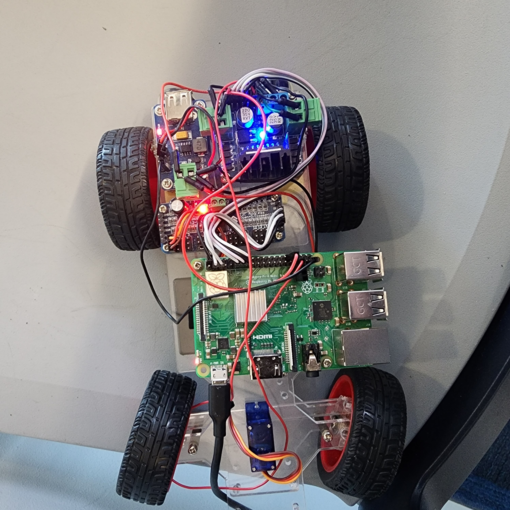
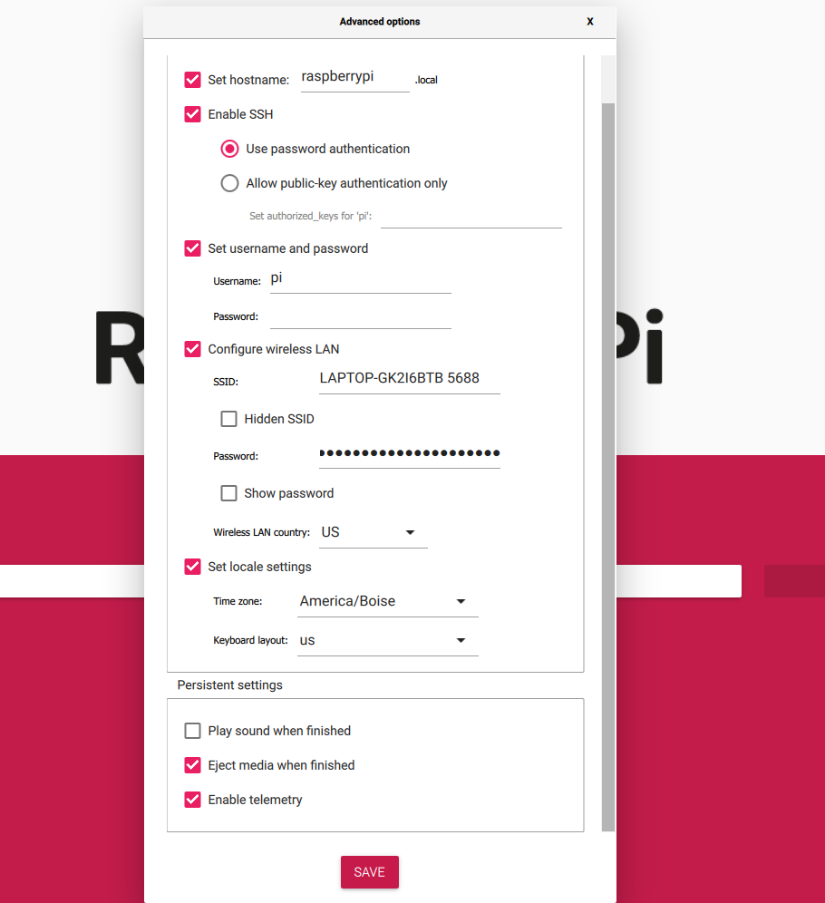
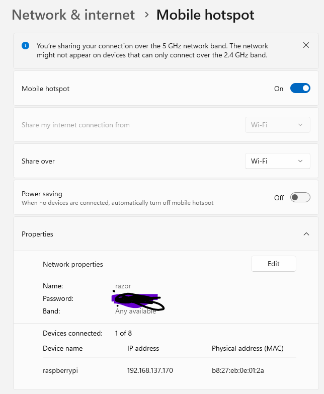

# Rover Detials

The rover is built with a raspberrypi 3b with 2 moters on the back and stearing in the frount. The Raspberrypi is power by a power bar and the back is powered by 2 lithim batteries.

## The RaspberryPi
We started off the project with a raspberrypi W0 and programing it. Latter on we swiched to the raspberrypi 3 becuase we wanted to run python code on the rover to be able to move it and to acomplish the goal. There was a issue of conneting to raspberrypi becaue of the campus wifi and also the wifi at the appartments.

The Fix:

The best solution was to set the SSID to a host laptop, so in this case it was the LAPTOP-GK2I6BTB 5688. You get this by turning on the hotspot on the laptop. My laptop was in Windows 11 but it works the same.

This image show the ip for the pi, this allows you to ssh into the pi with ssh pi@[ip address]

### Some of the other errors
In this project there has been many errors that were unexpected for the first time working with hardware. There has been a lot of learning, one of them was finding the pathing for RPi.GPIO on the raspberrypi this caused me to make a vetural server and installing the pakages there and that was when I was able to get it to run without errors.